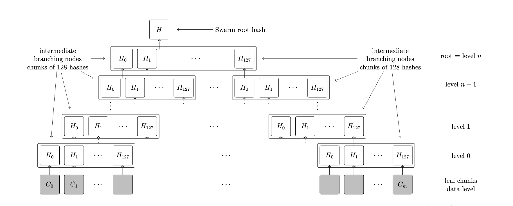

# 前言
要阅读源码，首先要对bee node的运行机制(架构，底层)等的机制有比较好的掌握
# 参考文章
- [https://www.ethswarm.org/swarm-whitepaper.pdf](https://www.ethswarm.org/swarm-whitepaper.pdf)
- [https://www.ethswarm.org/The-Book-of-Swarm.pdf](https://www.ethswarm.org/The-Book-of-Swarm.pdf)

# tokenomic
主要分成两大块
## BondingCurve机制
通过BC这个数学曲线来控制价格与供给的关系，请认真理解这段话的逻辑，是价格与供给关系的控制，这个机制**完全没法**用来单一的控制价格，个人觉得有两点好处
- BC机制本身有比较好的实际经济参考价值
- BC是部署在智能合约上的，这个可以用来做bzz价格的预言机，可以根据bzz的价格来动态调整swarm上的存储成本
## 激励机制

swarm主网上线后虽然没有对bee node做质押bzz的要求，但这不代表以后就没有这个机制，以后的版本中必然是会出现具备质押条件的

目前看应该是官方还没详细设计出更灵活更合理的质押机制，《book of swarm》里面有insurance这一章节，但是很多描述实现的部分是缺失的

# Bee node在swarm中的通讯模型

# 上传文件的机制

## 分解文件成chunk

上传文件的时候会将文件切割成一个个的小块(chunk)，然后将每个chunk作为叶子构造一个`merkle-tree`，随后这些chunk会被分散在不同的bee node中存储，从而达到一个文件的内容不会被追踪定位的效果

其中，每个chunk大小为`4KB`，每个chunk都有独立的address
设计成这样的原因是防止bee node的onwer没办法轻易的从存储的数据(chunk)中获取到完整的原始内容，**从而确保数据的隐私性，不会被随意审查到**，当然，用户上传数据的时候也可以选择做一层加密，加强数据的机密程度

## 将chunk放置到swarm集群中

bee node通过`push-sync`(swarm的内部协议)协议将chunk放到swarm集群中

## 冗余机制
每个chunk都会让周围比较靠近的bee node都存一份，以此做数据冗余

## 疑问？

